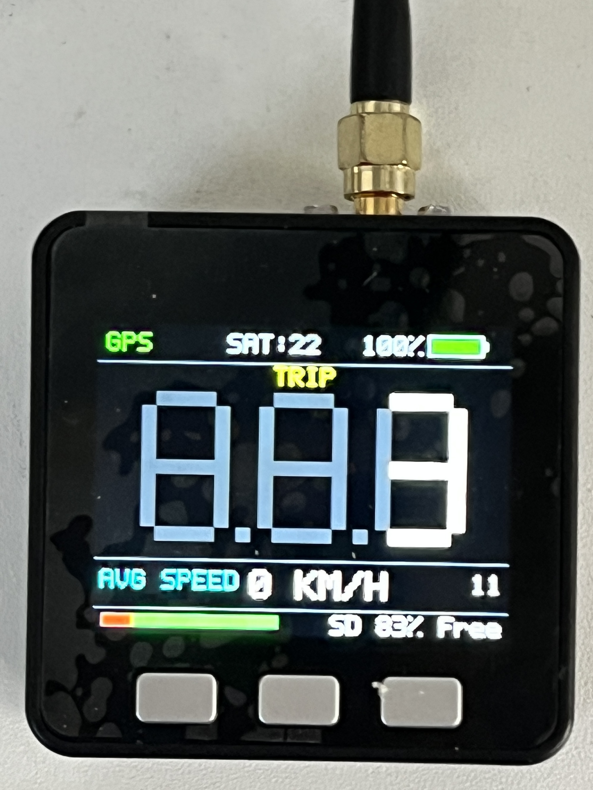
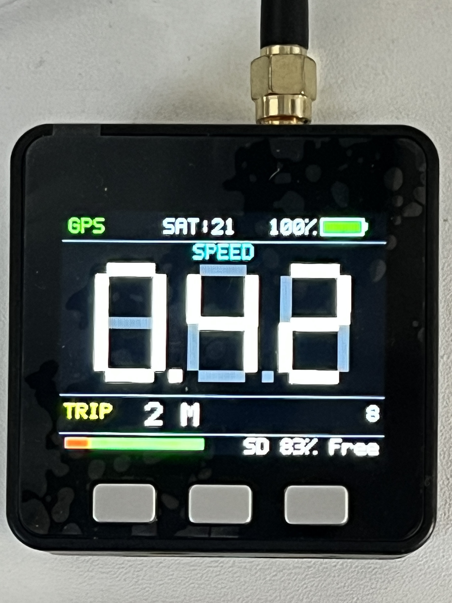
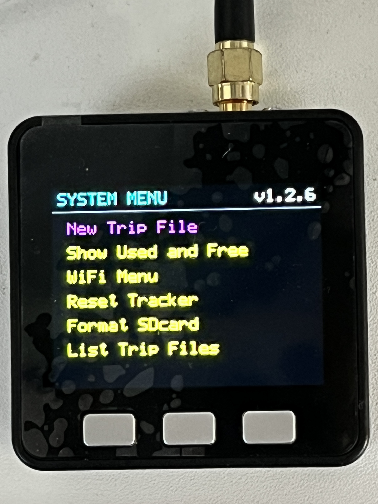
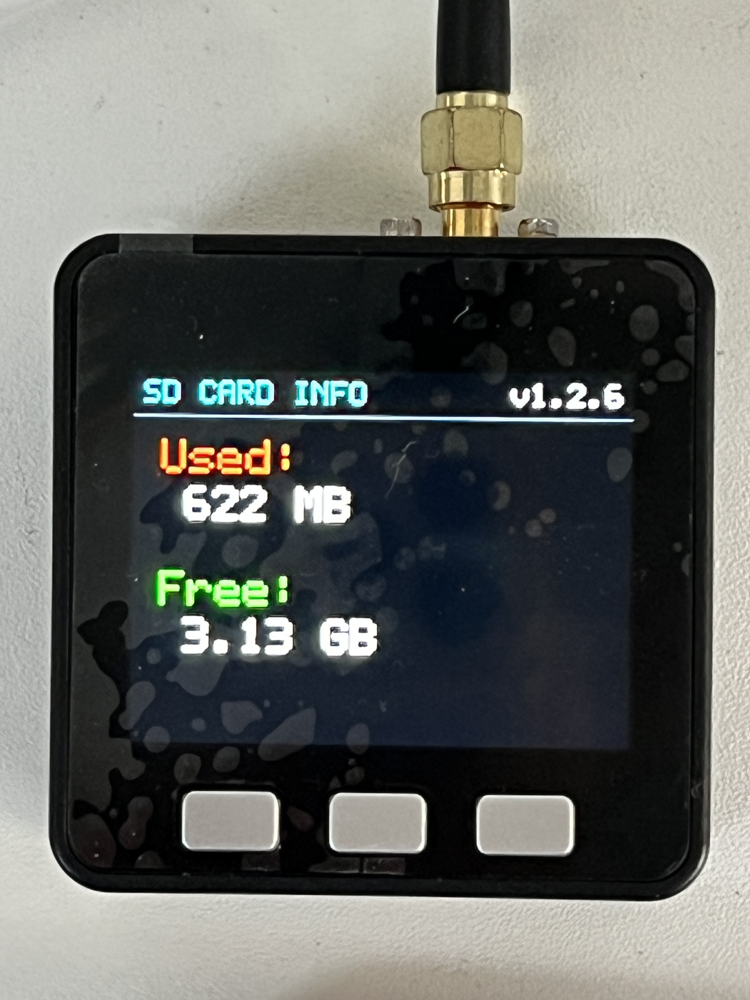
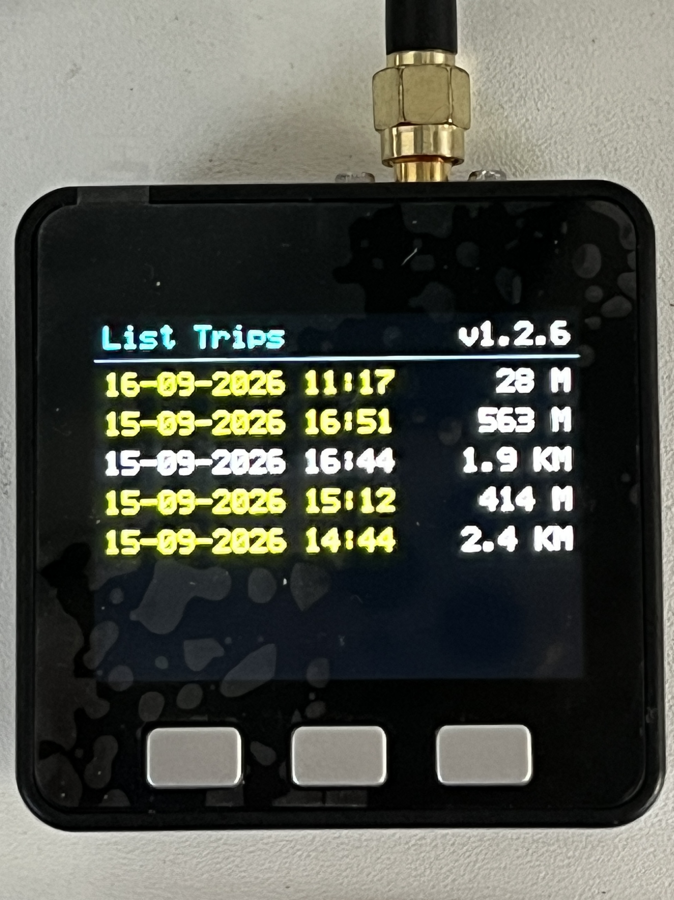
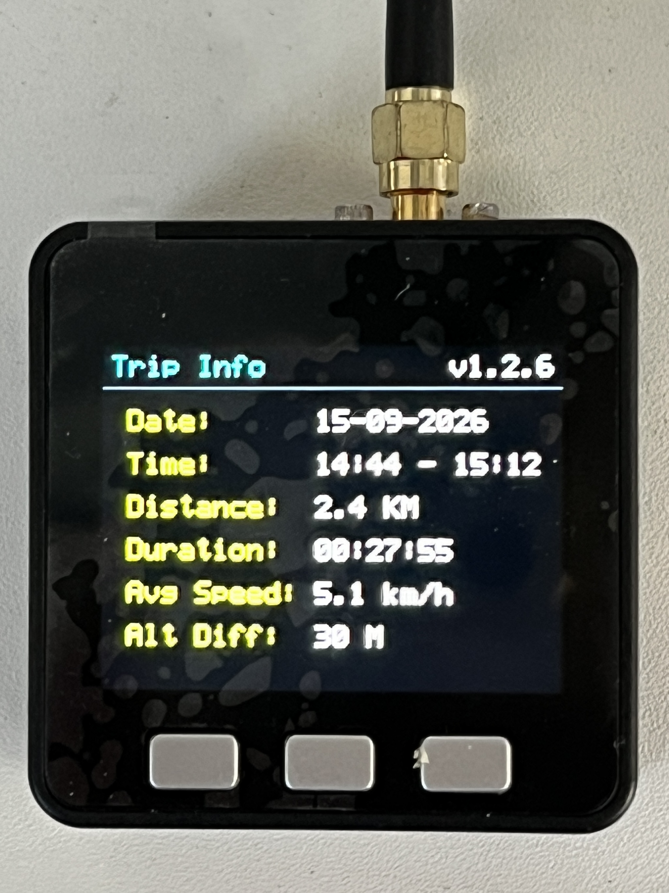
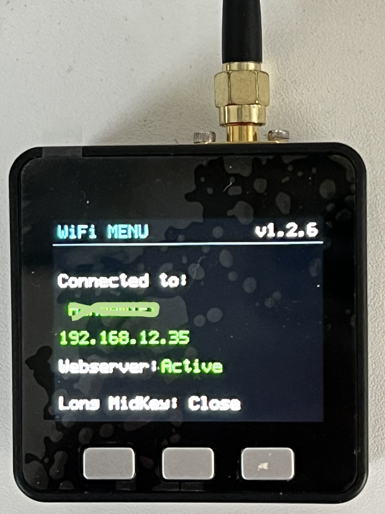
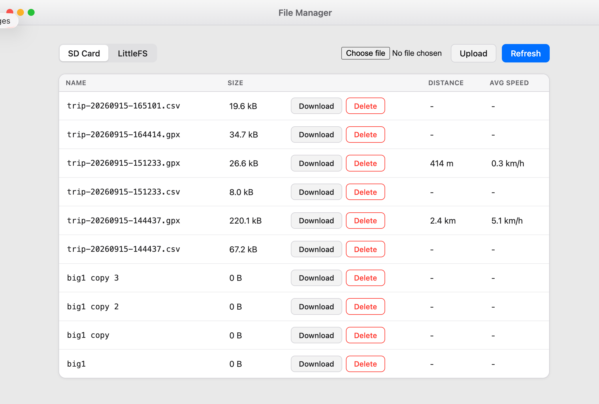

# tripTracker

Native ESP-IDF GPS trip- and speedometer for:

- M5Stack Core Basic v2.7 (ESP32, 320x240 ILI9342C)
- M5Stack Module GPS v2.0 (AT6668)
- VSCode + Espressif ESP-IDF extension

No Arduino framework, M5Unified, TinyGPS++ or other external component is required.

## Controls

- **Button A (left), short press:** switch to the **TRIP** screen.
- **Button A (left), long press (~0.8 s):** reset TRIP distance and trip average.
- **Button B (middle):** display off. Press any button to wake it again.
- **Button C (right):** switch to the speed screen and toggle between current **SPEED** and **AVG SPEED**.

## Screens and menus

### Main screen

The main screen contains:

- **GPS / NO GPS:** whether a valid GPS fix is available.
- **SAT:** the number of satellites in use.
- **Battery and charging:** the battery percentage and charging status.
- **TRIP screen:** the large value is the current trip distance. The lower line shows current or average speed and the number of recorded points.

- **SPEED / AVG SPEED screen:** the large value is the current or average speed. The lower line shows the trip distance and the number of recorded points.

### System Menu

Open and close the System Menu by holding the middle button. Use the left and right buttons to move through the choices and press the middle button to select one:

- **New Trip File:** closes the current export and starts a new GPX/CSV trip file. The TRIP distance and trip average are reset.
- **Show Used and Free:** displays the used and free space on the SD card.
- **WiFi Menu:** starts WiFi and opens the WiFi status screen and web file manager.
- **Reset Tracker:** restarts the ESP32 application.
- **Format SDcard:** formats the SD card and returns to the System Menu. This removes the files on the card.
- **List Trip Files:** opens the list of saved trips.
- **Exit:** closes the System Menu and returns to the main screen.

### SD Card Info

This screen is opened through **Show Used and Free**. It shows the amount of storage currently used and the amount still free on the SD card. Press the middle button to return to the System Menu.

### List Trips

This screen is opened through **List Trip Files**. Each row shows the local date and time at which a trip was created and its recorded distance. Use the left and right buttons to select a trip, then press the middle button to open its details. Hold the middle button to return to the System Menu.

### Trip Info

The Trip Info screen is opened by selecting a trip in **List Trips**. It shows:

- start date and start/end time;
- total distance;
- trip duration;
- average speed;
- altitude difference.

Press the middle button to return to the trip list. There is currently no separate Trip Info photo in `assets`.

### WiFi Menu

The WiFi Menu starts the browser-based file manager. When WiFi connects, the screen shows the network name, IP address and webserver status. If connection setup is not available, the device starts a captive portal at `192.168.1.4` so WiFi credentials can be configured.

Open `http://tripTracker.local` after connecting, or use the displayed IP address. The file manager can:

- list files on the SD card and internal LittleFS storage;
- download files;
- upload files;
- delete files, except the web interface files themselves;
- show distance and average speed for SD-card GPX trip files.

Hold the middle button to close the WiFi Menu. There is currently no separate WiFi Menu photo in `assets`.

## Display

- Current speed or trip-average speed: large 0..999 km/h readout.
- Distance: meters below 1000 m; km automatically from 1000 m onward.
- TRIP or TOTAL indication.
- GPS fix and satellite count.
- Battery icon and IP5306 battery level (0/25/50/75/100%).
- Charging indication.

The IP5306 reports battery level in coarse 25% steps; this is a limitation of the available battery-status register, not of the UI.

## Battery-dependent display timeout

While charging over USB, automatic display timeout is disabled.

| Battery | Timeout |
|---:|---:|
| 100% | 120 s |
| 75% | 90 s |
| 50% | 60 s |
| 25% | 30 s |
| 0% | 15 s |

Button B always allows the display to be switched off immediately. GPS acquisition, speed and distance measurement continue while the display is off.

## GPS hardware / DIP switch

The project uses **UART2** on the standard Core Basic M5-Bus UART pins:

- GNSS TX -> M5-Bus pin 15 -> Core **GPIO16** (ESP32 RX)
- GNSS RX -> M5-Bus pin 16 -> Core **GPIO17** (ESP32 TX)
- UART: **115200 baud, 8N1**

Set the GPS v2.0 DIP switches so GNSS TX/RX are routed to M5-Bus pins 15/16 (GPIO16/GPIO17). Do **not** select GPIO12 on the Basic during boot; GPIO12 is a strapping pin and M5Stack explicitly warns that this can prevent the Basic from booting.

PPS is not required by this application.

## GPS update rate

At every boot the software sends:

    $PCAS02,100*1E

This requests a 100 ms positioning interval (10 Hz). It is intentionally not saved into GNSS flash; the application simply requests it again at boot.

Speed comes directly from the NMEA RMC **Speed Over Ground** value and is converted from knots to km/h. A light adaptive filter stabilizes the visible number without heavily delaying acceleration/deceleration.

Distance is integrated from GNSS Speed Over Ground. Values below 1.0 km/h are treated as stationary to prevent slow distance creep at rest.

## TRIP average

The average starts when valid GNSS speed first reaches 1.0 km/h after boot or a TRIP reset. It is calculated as trip distance divided by elapsed trip time, so later stops lower the trip average, as on a normal vehicle trip computer.

## Persistent TOTAL

TOTAL is stored in ESP-IDF NVS. To avoid excessive flash writes, it is checkpointed approximately every 1 km. Therefore, a sudden total power loss can lose up to roughly the last kilometre from TOTAL. TRIP is intentionally not persistent.

## Web GUI file manager

While `[WiFi Menu]` is open, a browser-based file manager is served at `http://tripTracker.local` (or the AP-mode IP during captive-portal fallback). It lets you browse, download, upload, and delete files on the SD card or on the device's internal LittleFS storage.

- Files are listed newest first.
- Trip `.gpx` files on the SD card also show their total distance and average speed, read from the matching CSV export.
- `[Download]` and `[Delete]` are buttons; `[Refresh]` reloads the list on demand.
- The GUI's own LittleFS files (`style.css`, `index.html`, `app.js`) can never be deleted; their `[Delete]` button is shown disabled.

Wi-Fi and the webserver only run while `[WiFi Menu]` is open, to minimize power usage otherwise.

## Open in VSCode / ESP-IDF

1. Unpack `tripTracker.zip`.
2. In VSCode choose **File -> Open Folder...** and open the `tripTracker` directory.
3. Make sure the Espressif ESP-IDF extension is configured for an installed ESP-IDF 5.x environment.
4. Select target **esp32**.
5. Connect the M5Stack Core Basic v2.7 by USB-C.
6. Select the serial port in the ESP-IDF status bar.
7. Build, Flash and Monitor.

Equivalent ESP-IDF terminal commands:

    idf.py set-target esp32
    idf.py build
    idf.py -p /dev/cu.usbserial-XXXX flash monitor

Use your actual serial device for the final command.

## Project structure

    m5stack-speed/
    ├── CMakeLists.txt
    ├── partitions.csv
    ├── sdkconfig.defaults
    ├── main/
    │   ├── CMakeLists.txt
    │   └── app_main.c
    └── components/
        ├── board/        buttons + IP5306 battery status
        ├── gps/          UART + NMEA RMC/GGA parser + 10 Hz request
        ├── lcd/          native ILI9342C SPI driver + speedometer UI
        ├── sdcard/       SD-card mount, GPX/CSV trip export, trip listing
        ├── speedometer/  filtering, distance and average speed
        └── webserver/    WiFi-menu web GUI file manager (SD card / LittleFS)

## Important design choices

- Wi-Fi and Bluetooth are not enabled, reducing unnecessary power use.
- SD card is needed for tracking
- GPS continues running with the LCD backlight off.
- The large speed number uses a custom seven-segment renderer, so it remains readable at a glance and requires no font files.
- The project currently targets the exact Core Basic v2.7 pinout.
